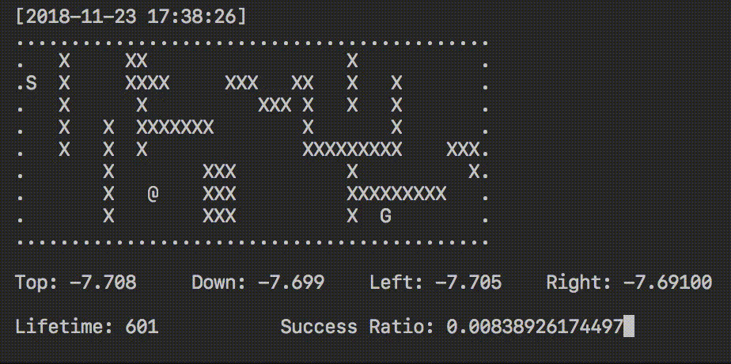
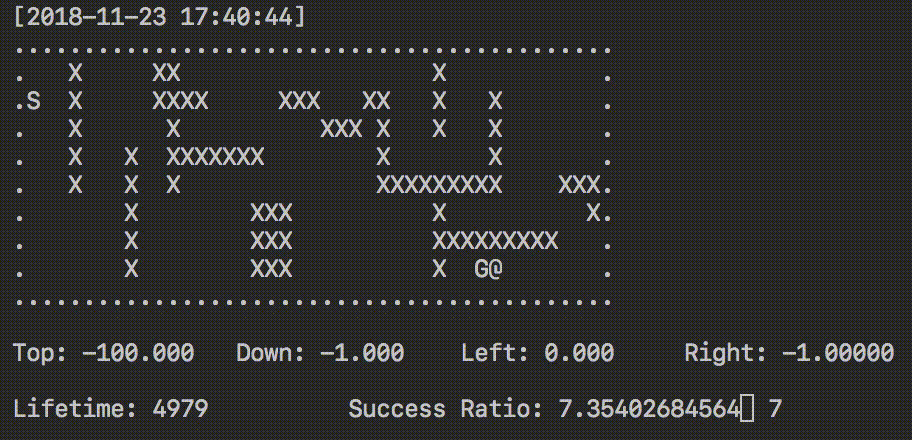

# Q 学习可视化工具
## 概述
Q学习是一种在机器学习中使用的强化学习技术。Q学习的目标是学习一种策略，告诉智能体在特定情况下应该采取的行动。它不需要环境模型，并且能够处理具有随机性转移和奖励的问题，而无需进行特别的适配。

在这个工具中，我们使用 `curses` 来渲染地图以及显示各种模拟统计信息，例如特定状态的 Q 表条目。以下是程序运行的一些示例：

未训练智能体的探索 | 训练后智能体的导航
------------ | -------------
 | 


## 使用方法
您可以创建适合矩形形状的自定义地图。或者，您也可以试验本仓库中提供的几张地图。通过以下命令启动模拟：

```
python rlearn.py <地图名称>    示例：python rlearn.py advance_cliff.txt
```

您可以按下 `space` 键跳过几个训练世代，按 `esc` 键退出模拟。

## 自定义设置
除了地图，您还可以自由修改代码中的各个方面，例如可视化的刷新率，是否进行预训练以及学习策略。

__学习策略__ - 在 `Agent` 对象的初始化中，您可以选择使用 `qlearn（默认）` 或 `sarsa` 策略。

__刷新率__ - `第290行：sleep_time = 0.1`，修改对应的循环间隔时间。

__预训练__ - `第294行：my_agent.fastforward(100000)`，修改预训练的周期数量。

#### 自定义地图创建
```
在创建自定义地图时，以下是各符号的解释：
'x' - 表示致命物体，智能体应避免踩到
'.' - 表示障碍物，虽然无害但会阻挡移动
'S' - 表示起点
'G' - 表示终点
```
